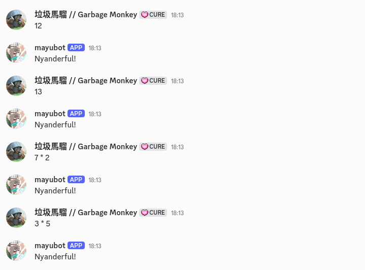

# MayuBot

A collaborative turn-based counting discord bot. 

## Screenshot

## Tech Stack:

- Implememtation language: java
- Build System: maven
- Discord Framework: jda

## Implemented Features:

- Systems:
  - Saves the current count on stopping, and remembers during starting up again
  - Mode where the bot randomly chooses a number between 1 and the latest saved count, to overcome situations where counts constantly restarts at 1.

- Parsing And Evalutation:
  - Ability to parse arbitary expressions composing of operators, floats and integers.
  - Parsing and evaluating Function Call: `factorial, sum, floor, ceiling`
  - Prints a success message when continuing the count.
  - Prints an error message when miscounted.
  - Can switch counting modes from standard, even and fibonnaci

- Discord Interactions:
  - Query longest counting streak
  - Allow mods to switch the counting mode dynamically
  - Allows users to display a list of callable functions, with their types required
  - Help Message: gives a summary of the grammar of the language the bot understands
  - About Message: a simple about me for the bot

## ToDo:

- Infrastructure
  - Docker file for easier deployment

- Code / Systems
  - Implement a custom timestamping system to solve problems when two users submit a message at the same time
  - Challenge Mode: the bot randomly chooses not to display a success or an error message

- Parsing
  - Massive refactoring is required to simplify the parser
  - Parsing and evaluating of trigonmetric functions
  - Parsing and evaluating of binary literals
  - Parsing and evaluating of hexadecimal literals
  - Parsing and evaluating of binary operators
  - Parsing and evaluating of latex fractions `$\frac{2}{4}$`

- Discord Bot Interactivity:
  - Success message modification
  - Error message modification
